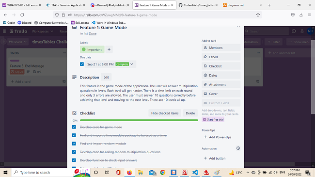

# timesTable Challenge

[Github Repository](https://github.com/Coder-Nicki/times_tables_challenge)

## Overview
This terminal application allows users to practise their multiplication skills and to race to complete all the levels in time to be crowned the champion. This app is aimed at students of all ages looking to improve their skills in this mathematical ability.

## Code Styling Guide

- [Pep8 styling guide](https://peps.python.org/pep-0008/)

## Features

The first feature of this application is 'Game Mode'. Users start at level one and have to answer multiplication sums correctly in order to move up to the next level. However, if they get too many wrong, or take too long to answer them, then they are out of the game. There are 10 levels that all increase in difficulty. Can you be named the champion and complete all levels successfully?

The second feature is the 'Practice Mode'. Users can choose out of 3 difficulty levels to practise. The levels are easy, medium and hard. During the practise time, the correct and incorrect answers are recorded. The time is also recorded so the user knows how long it took them to answer so many questions. Each practice level has a limit of 100 questions, before they are automatically exited from that mode. The user is also able to exit whenever they like by pressing 'q'.

The third feature is the One Minute Challenge mode. This mode allows the user to see how many questions they can answer correctly in one minute.

Time is a key feature of all modes. The time taken to answer questions is recorded and then printed back to the user. 

The application also utilises a terminal menu so that the user can easily choose where they want to go in the application. 

## Implementation Plan

[Trello board](https://trello.com/b/Q7epZ4TZ/timestables-challenge)

The implementation of this application has gone according to plan. A flowchart was created first. Code was then written for each feature. Unit and manual tests started to be done. The README was updated. Then instructions and a bash script created for others to access app.

Two things to improve still are: 

- More unit testing
- A better end/exit message that utilises terminal art or animation

## Manual Testing
| Feature | Expected Outcome | Actual Outcome | Any remaining issues|
| --------- | ----- | ----- | ----- |
|User is asked to input name | User's name appears on welcome message | As expected | Nil|
|Main menu is linked to chosen mode| After the user presses on the item, a new screen opens up with chosen mode| As expected| Nil|
| Exit mode exits out of the whole app| When user presses exit mode the app terminates| As expected | Nil|
|In game mode, the user goes onto the next level when previous level is successfully achieved| Game mode - Level one calls for level two. Level two calls for level 3, et cetera| As expected|Nil|
|Game mode - User gets 3 questions wrong| If user gets 3 questions wrong then they get a printed message and they are returned to the main menu|As expected|Nil|
|Game mode - User is too slow| If user's time is over the given time than they are exited from the game to the home menu|As expected|Nil|
|Game mode - The given times are all correct in each level. Check each level. |Each level has a certain time before they fail the level|As expected|Nil|
|Terminal menu for practice mode|All items call the correct difficulty level|As expected|Nil|
|Practice mode menu - 'Back to main'|Should return the user to the main menu|As expected|nil|
|Exit from practice mode|When the user types in 'q' they are exited from the mode back to the main menu|As expected|Nil|
|Practice mode - End message|An end message is displayed with a correct and incorrect score count on user pressing 'q'|As expected|Nil|
|Practice mode - User gets to 100 correct answers|User will be exited from practice mode difficulty level|As expected|Nil|
|Practice mode - User choice|User enters a number in the range 1-12, otherwise they get an error message to try again|As expected|Nil|
|Practice mode - in user choice there are 20 questions |After the 20 questions an end message is displayed with number of correct and incorrect answers.|As expected|Nil|
|Practice mode - in user choice correct and incorrect answers correct number | The end message displays the correct number of correct and incorrect answers - Tally should equal 20 if whole round completed|As expected|Nil|
|Practice mode - answer to questions |user presses a letter (not number or'q' when answering questions)|It is an incorrect answer|In future, could give error message to try again|
|One minute time|In one minute challenge mode, the user can only answer questions for 1 minute|As expected|Nil|
|One minute mode - Incorrect answer|If user enters an incorrect answer then they get the message 'wrong' before next question|As expected|Nil|
|One minute mode - End message|An end message is displayed with how many correct and incorrect answers they got in one minute|As expected|Nil|

## Unit Testing

Please see `test_game.py`

This tests that the numbers being multiplied give a correct answer.

## Help Documentation

1. First check that you have git installed on your terminal. Type in `git --version`. If it outputs a version continue to next step. Otherwise go to `https://www.atlassian.com/git/tutorials/install-git` for help in installing git.

2. In your terminal type in `git clone https://github.com/Coder-Nicki/times_tables_challenge`

3. Next type in `cd times_tables_challenge`

5. Then change into the right folder `cd src`

6. Then type in `./wrapper.sh`. This command sets up your environment and installs any needed packages. It then starts the application. 

7. Enjoy using the timesTable_Challenge application.

## References
Guido van Rossum, B. W. N. C., 2001. PEP 8 – Style Guide for Python Code. [Online] 
Available at: https://peps.python.org/pep-0008/
[Accessed 23 09 2022].

